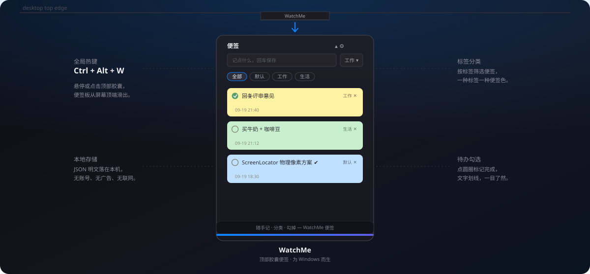
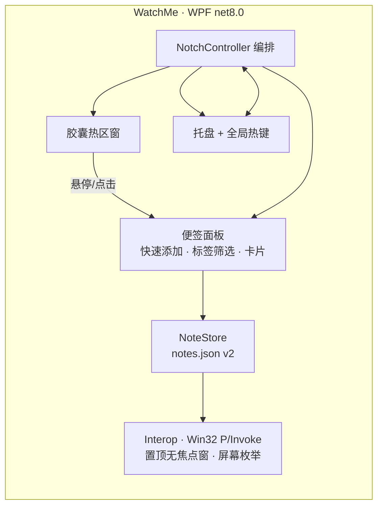

#  WatchMe

<div align="center">
  

[](https://github.com/Aafff623/WatchMe/releases/latest)
[](https://github.com/Aafff623/WatchMe/actions/workflows/release.yml)
[](https://github.com/Aafff623/WatchMe/actions/workflows/release.yml)

[](LICENSE)

**屏幕顶部一枚胶囊，下拉就是你的便签板——随手记、分类、勾掉，完事。**
</div>

---

## 它解决什么

想到什么 → 鼠标扫过屏幕顶部 → 敲字回车 → 完事。不切窗口、不找应用、不点保存。

界面形态参考 [好用便签](https://www.haoyong333.com/)：一张张彩色便签卡片，按标签分类，待办打勾划掉。全部本地存储，无账号、无广告、无联网。

## 功能

| 功能 | 说明 |
|---|---|
| ⚡ 快速添加 | 输入框打字回车即存，自动防抖落盘 |
| 🏷️ 标签分类 | 便签归属标签（默认/工作/生活…可直接输入新标签），顶部 chips 一键筛选 |
| 🟡 彩色卡片 | 每种标签一种便签色，一眼区分 |
| ☑️ 待办勾选 | 点圆圈标记完成，文字划线 |
| ✏️ 即点即改 | 点开卡片直接改，自动保存；删除可撤销 |
| 🖥️ 贴边呼出 | 悬停/点击屏幕顶部胶囊滑出，Esc 或失焦自动收起 |
| ⌨️ 全局热键 | Ctrl+Alt+W 随时呼出（可在设置修改，被占用时托盘提醒） |
| 🌗 主题 | 深色 / 浅色 / 跟随系统 |
| 🚀 开机自启 | 一键开关，写 HKCU Run，无需管理员 |

数据在 `%APPDATA%\WatchMe\notes.json`（JSON 明文，可随意备份）。

## 快捷键

| 按键 | 作用 |
|---|---|
| `Ctrl+Alt+W` | 全局呼出/收起便签板（可改） |
| `Enter` | 快速添加框内保存新便签 |
| `Ctrl+N` | 焦点回到添加框 |
| `Esc` | 收起面板 |

## 安装

从 [Releases](https://github.com/Aafff623/WatchMe/releases/latest) 下载 `WatchMe-windows-x64.zip`，解压后运行 `WatchMe.exe`（自包含单文件，无需安装 .NET）。

> 未做代码签名，首次运行如遇 SmartScreen 提示，点「更多信息 → 仍要运行」即可。

## 本地开发

```powershell
git clone https://github.com/Aafff623/WatchMe.git
cd WatchMe
dotnet build WatchMe.sln
dotnet test WatchMe.sln
dotnet run --project src/WatchMe
```

要求 .NET 8 SDK（Windows）。推送 `main` 或 `v*` tag 时 CI 自动构建 + 跑测试 + 产出 Release 附件。

## 架构



历史说明：本仓库最初是 oil-oil/NotchNotes（macOS 刘海笔记）的 fork，2026-09 用 WPF 全面重写为 Windows 原生应用；此后进一步聚焦为便签形态（v2.0），Markdown 编辑器、文件暂存架、剪贴板历史、防休眠等模块已移除（见 git 历史）。

## License

[MIT](LICENSE) © threetwoa
