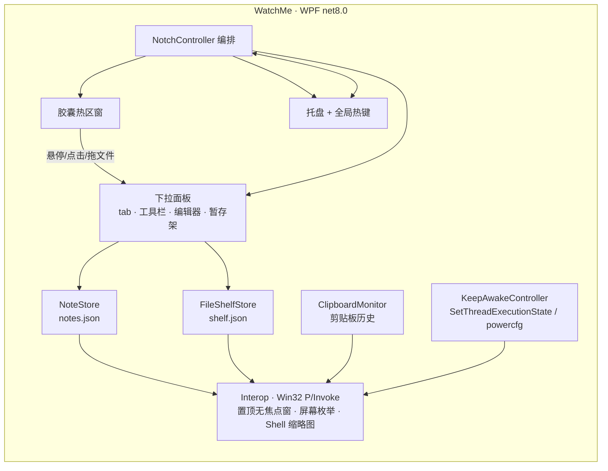

#  WatchMe

<div align="center">
  

[](https://github.com/Aafff623/WatchMe/releases/latest)
[](https://github.com/Aafff623/WatchMe/actions/workflows/release.yml)
[](https://github.com/Aafff623/WatchMe/actions/workflows/release.yml)

[](LICENSE)

**屏幕顶部的一枚胶囊，下拉即是：多标签 Markdown 笔记 · 文件暂存架 · 防休眠 · 剪贴板历史。**
</div>

---

## 它解决什么

- **随手记**：想到什么，鼠标扫过屏幕顶部就写，不用切换窗口、不用找应用。
- **随手存**：文件拖到顶部胶囊就暂存起来，随手再拖出到聊天窗口、浏览器上传框、邮件附件。
- **别睡**：演示/下载/挂机时一键咖啡模式；笔记本合盖也不休眠（可自动恢复）。
- **别丢**：剪贴板历史自动留档文本与图片，搜索找回上一次复制的内容。

全部原生 WPF 实现，单进程、无 WebView、常驻内存小、不弹多余窗口。

## 功能

| 模块 | 说明 |
|---|---|
| 🗒️ 多标签笔记 | Tab 页签 + 标题自动取首行；编辑/分栏/预览三种视图；Tab/Shift+Tab 列表缩进；查找替换；删除可撤销 |
| 📝 Markdown | 标题/粗斜体/删除线/代码/链接/引用/任务列表工具栏，实时预览渲染 |
| 🖼️ 图片粘贴 | Ctrl+V 直接把剪贴板图片存入笔记（本地保存，不依赖图床） |
| 📎 文件暂存架 | 拖入即存（只记路径不复制）、拖出到任意应用、Shell 缩略图、Ctrl/Shift 多选、缺失文件标记 |
| 👀 快速预览 | 空格键 Quick Look：图片 / 文本 / 音视频 / 文件信息，◀▶ 翻阅 |
| ☕ 防休眠 | 咖啡模式（CPU/屏幕保持唤醒）；「合盖不休眠」走 powercfg 提权，异常退出自动恢复 |
| 📋 剪贴板历史 | 文本 + 图片自动记录、搜索、一键回贴、直接追加到当前笔记 |
| 🖥️ 多显示器 | 顶部胶囊可指定停靠的屏幕 |
| 🌗 主题 | 深色 / 浅色 / 跟随系统 |
| 🚀 开机自启 | 一键开关，写 HKCU Run，无需管理员 |

## 快捷键

| 按键 | 作用 |
|---|---|
| `Ctrl+Alt+W` | 全局呼出/收起面板（可在设置中改） |
| `Ctrl+N` | 新建笔记标签 |
| `Ctrl+F` | 查找替换 |
| `Tab` / `Shift+Tab` | 列表缩进 / 反缩进 |
| `Ctrl+V` | 粘贴图片进笔记 |
| `Space` | 预览暂存架选中文件 |
| `Delete` | 从暂存架移除 |
| `Esc` | 收起面板 |

## 安装

从 [Releases](https://github.com/Aafff623/WatchMe/releases/latest) 下载 `WatchMe-windows-x64.zip`，解压后运行 `WatchMe.exe`（自包含单文件，无需安装 .NET）。

> 未做代码签名，首次运行如遇 SmartScreen 提示，点「更多信息 → 仍要运行」即可。

主程序无窗口，启动后常驻系统托盘 + 屏幕顶部胶囊。

## 本地开发

```powershell
git clone https://github.com/Aafff623/WatchMe.git
cd WatchMe
dotnet build WatchMe.sln
dotnet test WatchMe.sln
dotnet run --project src/WatchMe
```

要求 .NET 8 SDK（Windows）。发布自包含单文件：

```powershell
dotnet publish src/WatchMe/WatchMe.csproj -c Release -r win-x64 --self-contained true -p:PublishSingleFile=true
```

推送 `main` 或 `v*` tag 时 CI（GitHub Actions, windows-latest）自动构建 + 跑测试 + 产出 Release 附件。

## 架构



数据都落在 `%APPDATA%\WatchMe\`（JSON 明文，可随意备份）；设计决策记录见 [docs/adr/](docs/adr/)。

## 致谢

Inspired by [oil-oil/NotchNotes](https://github.com/oil-oil/NotchNotes)（macOS 刘海笔记应用）—— 本项目是其 Windows 平台的独立重写，不共享上游代码。

## License

[MIT](LICENSE) © threetwoa
